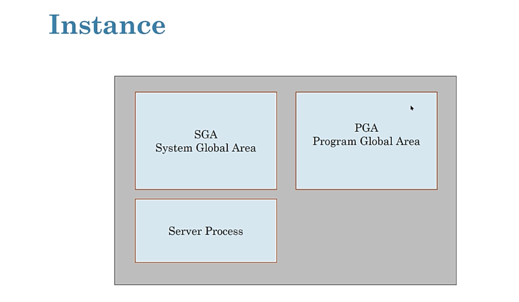
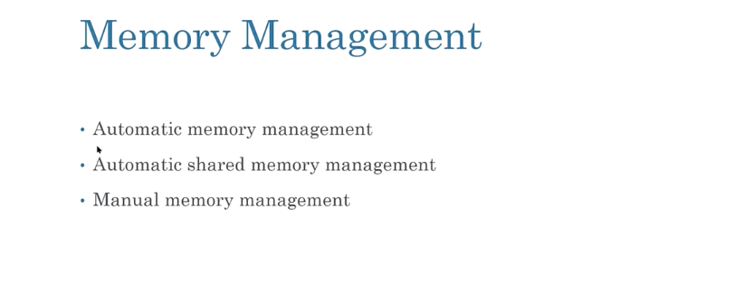
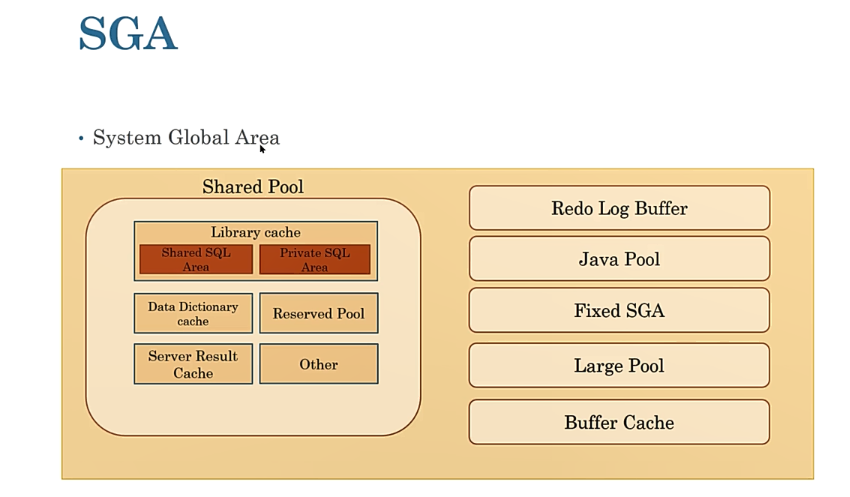
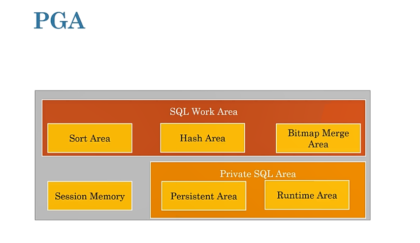
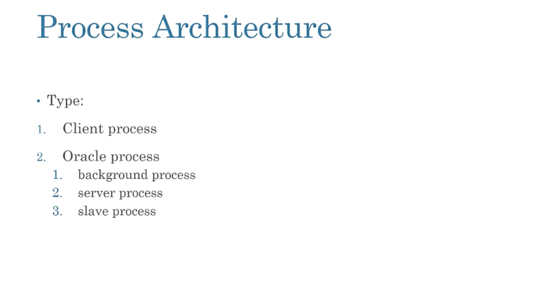
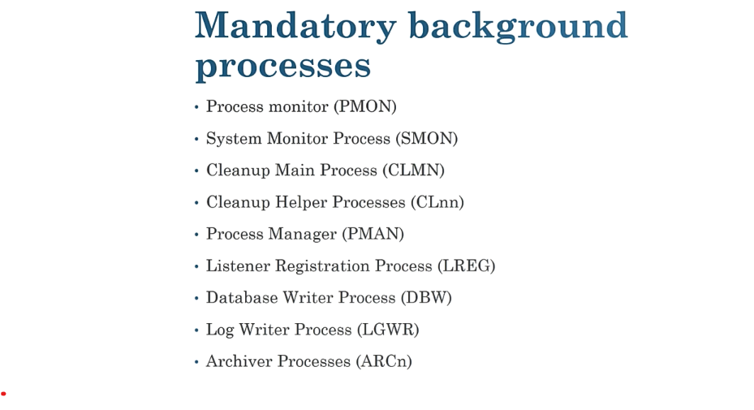

# Oracle SGA (System Global Area) Components

The **System Global Area (SGA)** is a shared memory area in Oracle Database that contains data and control information for one Oracle instance. It plays a crucial role in improving database performance and supporting various Oracle features.

## Main SGA Components

### 1. **Database Buffer Cache**
   - **Purpose**: Stores copies of data blocks that are read from the data files of the database.
   - **Functionality**: 
     - Reduces disk I/O by caching frequently accessed data.
     - Provides faster access to data by storing recently or frequently accessed blocks in memory.

### 2. **Shared Pool**
   - **Purpose**: Stores shared resources, including SQL/PLSQL code, execution plans, and metadata.
   - **Components**:
     - **Library Cache**: Caches SQL and PL/SQL code, execution plans, and parsed SQL statements.
     - **Data Dictionary Cache**: Stores metadata about database objects such as tables, columns, and indexes.
   - **Functionality**: 
     - Improves performance by reducing the need for SQL parsing and reloading frequently used objects.

### 3. **Redo Log Buffer**
   - **Purpose**: Holds redo records that describe changes made to the database.
   - **Functionality**: 
     - Ensures data integrity by writing redo records to disk (redo log files).
     - Plays a key role in crash recovery, allowing the database to be restored to a consistent state.

### 4. **Java Pool**
   - **Purpose**: Stores Java-related objects and code, such as Java class definitions and stored procedures.
   - **Functionality**: 
     - Provides memory for Java applications running within the Oracle database.

### 5. **Large Pool**
   - **Purpose**: Provides memory for large memory allocations, including those needed by Oracle's backup, recovery processes, and parallel query operations.
   - **Functionality**: 
     - Helps handle large memory requirements efficiently.
     - Prevents overloading the shared pool with large allocations.

### 6. **Streams Pool**
   - **Purpose**: Stores memory required for Oracle Streams processes, such as data capture, apply, and propagation.
   - **Functionality**: 
     - Supports replication and synchronization of data between Oracle databases using Oracle Streams.

### 7. **Fixed SGA**
   - **Purpose**: Contains basic information necessary for the functioning of the Oracle instance.
   - **Functionality**: 
     - A small, fixed memory area that always exists within the SGA.
     - Helps manage pointers to other SGA components.

## SGA Memory Management
- The size of each SGA component can be adjusted depending on the system's requirements and workload.
- The **total size** of the SGA is defined when the Oracle instance starts and is important for performance optimization.

## Conclusion
The SGA is a critical part of Oracle's memory architecture, helping to optimize performance, data integrity, and resource management. Each of the components above plays a specific role in managing database operations efficiently.

# Components of the Shared Pool

The **Shared Pool** is a critical part of the System Global Area (SGA) in Oracle Database. It stores shared resources that multiple processes can access, helping to reduce memory usage and improve performance. The Shared Pool is divided into several components, each responsible for specific tasks.

## Main Components of the Shared Pool

### 1. **Library Cache**
   - **Purpose**: Stores SQL and PL/SQL code, execution plans, and parsed SQL statements.
   - **Functionality**: 
     - **SQL Cache**: Stores parsed SQL statements, execution plans, and related data to avoid re-parsing SQL queries every time they are executed.
     - **PL/SQL Cache**: Caches PL/SQL code, such as stored procedures, functions, and triggers.
     - **Execution Plans**: Stores execution plans for SQL queries to allow quicker reuse.

### 2. **Data Dictionary Cache (or Dictionary Cache)**
   - **Purpose**: Contains metadata about database objects such as tables, columns, indexes, users, etc.
   - **Functionality**: 
     - Reduces disk I/O by caching frequently accessed data dictionary information.
     - Improves performance by allowing faster access to metadata, which is needed during SQL execution.

### 3. **Control Structures**
   - **Purpose**: Contains memory for various internal control structures.
   - **Functionality**: 
     - These structures help manage the operations of the database and control various aspects of SQL execution and memory management.

### 4. **Cursor Cache**
   - **Purpose**: Stores SQL cursors for queries that are repeatedly executed.
   - **Functionality**: 
     - Improves performance by reusing SQL cursors, eliminating the need to open new cursors for the same SQL statement.
     - Cursor information includes the query, bind variables, execution plan, and more.

### 5. **Stored Procedure Cache**
   - **Purpose**: Caches the compiled code of stored procedures, functions, and triggers.
   - **Functionality**: 
     - Reduces the need to recompile PL/SQL objects, improving performance by providing quicker access to these stored procedures.

### 6. **Shared SQL Area**
   - **Purpose**: A memory area within the library cache that stores shared SQL statements and their execution plans.
   - **Functionality**: 
     - Helps optimize memory usage by allowing multiple sessions to share the same SQL statement and execution plan.
     - Reduces the overhead of re-parsing SQL statements.

## Summary
- The Shared Pool optimizes memory usage and performance by caching SQL queries, execution plans, PL/SQL code, and metadata.
- Key components include the **Library Cache**, **Data Dictionary Cache**, **Control Structures**, **Cursor Cache**, **Stored Procedure Cache**, and the **Shared SQL Area**.

# Difference Between Hard Parse and Soft Parse in Oracle Database

In Oracle Database, parsing refers to the process of analyzing and checking a SQL statement for syntax and semantic correctness. Parsing also involves generating an execution plan for the SQL query. There are two types of parsing: **Hard Parse** and **Soft Parse**.

## 1. **Hard Parse**
   - **Definition**: A **Hard Parse** occurs when Oracle Database does not find an existing execution plan for a SQL query in the shared pool and must generate a new plan from scratch.
   - **When It Happens**:
     - When a SQL statement is executed for the first time or when it has changed (e.g., new SQL text or bind variable).
     - When there is no matching SQL statement or execution plan in the shared pool to reuse.
   - **Processes Involved**:
     - Oracle checks the SQL statement for syntax errors.
     - Oracle generates a new execution plan.
     - The execution plan is stored in the shared pool for future reuse.
   - **Impact**:
     - A hard parse is resource-intensive because it requires additional CPU and memory to compile the statement and generate a new execution plan.
     - It increases system load and can affect performance, especially with frequent or repetitive SQL executions.

## 2. **Soft Parse**
   - **Definition**: A **Soft Parse** occurs when Oracle Database reuses an existing execution plan for a SQL statement, avoiding the need for a new hard parse.
   - **When It Happens**:
     - When an identical SQL statement (same text, bind variables, etc.) is executed again.
     - Oracle finds the statement in the shared pool and reuses the cached execution plan.
   - **Processes Involved**:
     - Oracle checks if an execution plan already exists in the shared pool.
     - If found, the cached plan is reused without needing to re-analyze the SQL.
   - **Impact**:
     - Soft parses are more efficient than hard parses because they save time and resources by reusing an already compiled execution plan.
     - This improves performance and reduces the overhead associated with SQL execution.

## Key Differences

| Aspect             | Hard Parse                                    | Soft Parse                                      |
|--------------------|-----------------------------------------------|-------------------------------------------------|
| **Definition**      | Involves generating a new execution plan.     | Reuses an existing execution plan from the cache. |
| **When It Happens** | When the SQL is new or changed.               | When the SQL is identical and already cached.     |
| **Resource Usage**  | High CPU and memory consumption.              | Lower CPU and memory consumption.                 |
| **Performance**     | Can negatively impact performance due to overhead. | Improves performance by reusing plans.            |
| **Execution Time**  | Takes longer to execute.                     | Executes faster due to plan reuse.                |

## Conclusion
- **Hard Parse** is more resource-intensive and can lead to performance degradation, while **Soft Parse** is more efficient and helps improve the overall performance of the database.
- Reducing hard parses by ensuring efficient use of the shared pool and SQL statement reuse is a key aspect of Oracle performance tuning.

# PGA



# Program Global Area (PGA) in Oracle Database

The **Program Global Area (PGA)** is a memory region in Oracle Database that is used by a single Oracle server process. It is a memory area that is private to each process, unlike the **System Global Area (SGA)**, which is shared by all processes in an Oracle instance. The PGA holds session-specific data and control information, such as execution contexts and variables related to the current session.

## Key Characteristics of PGA

- **Private Memory**: Unlike the SGA, which is shared across all sessions, the PGA is allocated for each user session, meaning it is **private** to that session.
- **Non-Shared**: It contains data that is not shared between processes, such as session-specific variables, and is cleaned up once the session terminates.
- **Session-Specific**: The contents of the PGA are specific to the session, and its size and structure depend on the activities performed during the session.

## Main Components of the PGA

### 1. **Session Memory**
   - **Purpose**: Stores session-specific information, including bind variables, and data structures related to SQL execution.
   - **Functionality**: It ensures that each session's data, such as cursor states and execution contexts, is kept private.

### 2. **Stack Space**
   - **Purpose**: Stores the execution stack for each server process.
   - **Functionality**: It is used to store data related to program execution, such as local variables, return addresses, and function calls.
   
### 3. **Sort Area**
   - **Purpose**: Stores data related to sorting operations for queries.
   - **Functionality**: Oracle uses this memory area when it needs to perform sorts (e.g., for `ORDER BY` operations) and when creating indexes. If the PGA is too small, Oracle may use temporary tables in disk storage instead of the PGA for sorting.

### 4. **Session Variables**
   - **Purpose**: Stores session-level variables.
   - **Functionality**: These variables are used for SQL execution and hold session-specific data such as session parameters, runtime statistics, and temporary results.

### 5. **Cursor State**
   - **Purpose**: Stores the state of SQL cursors.
   - **Functionality**: Keeps track of the current state of SQL cursors for the session. Each cursor has a private area in the PGA where it stores its execution context (e.g., bind variables, the result set of the SQL query, etc.).

### 6. **PL/SQL Memory (for PL/SQL Operations)**
   - **Purpose**: Holds memory for PL/SQL operations.
   - **Functionality**: When PL/SQL code is executed (such as stored procedures, functions, or triggers), it uses the PGA to store private PL/SQL variables, stack frames, and temporary objects.

## PGA Memory Allocation

- The PGA is allocated when a user session is initiated. The amount of memory allocated to the PGA depends on the configuration of the database and the workload.
- Oracle allows dynamic adjustment of PGA memory size, which can be managed through the `PGA_AGGREGATE_TARGET` parameter, which sets a target size for the PGA.
  
## Important PGA Parameters

- **PGA_AGGREGATE_TARGET**: Specifies the total memory available to all server processes for PGA memory.
- **WORKAREA_SIZE_POLICY**: Determines how memory for SQL operations is allocated between the PGA and the temporary space.
- **PGA_AGGREGATE_LIMIT**: Limits the total PGA memory consumption, preventing excessive memory usage by server processes.

## PGA vs. SGA

| Aspect               | PGA                                    | SGA                                    |
|----------------------|----------------------------------------|----------------------------------------|
| **Purpose**           | Private memory for each session        | Shared memory for all Oracle processes |
| **Scope**             | Specific to a single session           | Shared across all sessions             |
| **Content**           | Session variables, execution context, sorting memory | Data blocks, SQL execution plans, shared resources |
| **Managed By**        | Managed per session                    | Managed by the Oracle instance         |

## Conclusion

- The **PGA (Program Global Area)** plays a crucial role in managing session-specific data for Oracle Database.
- It includes memory areas for session variables, sorting, PL/SQL execution, and cursor management.
- Proper management of PGA memory is important for optimizing session performance and ensuring efficient resource allocation in Oracle.





```bash
    ps #or 
    ps -ef | grep oracle
    top
    #to see the list of all process
```
```sql
show parameter sga;
show parameter pga;

```

# Summary
# Oracle Database Instance and Memory Management  

## Instance Components  
1. **SGA (System Global Area)**  
   - Shared memory area used by all server and background processes in an Oracle Database instance.  
2. **PGA (Program Global Area)**  
   - Memory region specific to a single server process or background process.  
3. **Server Process**  
   - Handles user requests and interacts with the database on behalf of the user.  

## Memory Management Options  

### 1. Automatic Memory Management (Default)  
- When using `dbca` (Database Configuration Assistant) to create the database, you can specify a **Target Memory Size** (e.g., `MEMORY_TARGET` parameter).  
- The database instance automatically manages and tunes both the **SGA** and **PGA** to meet the specified target memory size.  

### 2. Automatic Shared Memory Management  
- You set the **Target Size** for the **SGA** using the `SGA_TARGET` parameter.  
- Additionally, you can specify the **PGA** size using the `PGA_AGGREGATE_TARGET` parameter.  
- The instance automatically adjusts components within the SGA but does not automatically tune between SGA and PGA.  

### 3. Manual Memory Management  
- In this mode, you manually configure several initialization parameters to allocate memory for different components of the **SGA** and **PGA** (e.g., `DB_CACHE_SIZE`, `SHARED_POOL_SIZE`, `PGA_AGGREGATE_TARGET`, etc.).  
- This requires careful monitoring and tuning by the database administrator.  


## SGA (System Global Area)  

The **SGA** is a shared memory area that is used to manage and coordinate many aspects of an Oracle database instance. It stores data and control information, enabling efficient communication and processing among server and background processes.  

### Components of the SGA  

1. **Shared Pool**  
   - Caches various types of data such as SQL, PL/SQL code, system parameters, and data dictionary information.  
   - The Shared Pool has the following subcomponents:  

     - **Library Cache**:  
       - Stores executable SQL and PL/SQL code, control structures, and metadata.  
       - Helps reduce the need for repeated parsing by enabling **soft parses** (reuse of previously parsed statements).  

     - **Data Dictionary Cache**:  
       - Caches metadata about database objects, such as tables, indexes, and users.  
       - Includes a **Row Cache**, which stores frequently accessed rows of data from the data dictionary.  

     - **Reserved Pool**:  
       - Used to allocate memory for large SQL or PL/SQL statements that cannot fit into the standard shared pool space.  

2. **Server Result Cache**  
   - Stores query results that can be reused by multiple sessions to improve performance.  
   - Reduces the need to re-execute frequently accessed queries.  


### Redo Log Buffer

The **Redo Log Buffer** is a memory structure within the **SGA** that stores redo entries. Redo entries contain information about changes made to the database, such as updates, inserts, and deletes. These entries ensure data recovery in case of a system failure.

1. **Flow of Redo Data**:
   - Changes made to the database are recorded as redo entries in the **Redo Log Buffer**.
   - These redo entries are generated in user memory space and transferred into the **Redo Log Buffer** in the **SGA**.

2. **Storage**:
   - Redo entries are stored in a **contiguous sequential space** in the buffer.

3. **LGWR Background Process**:
   - The **Log Writer (LGWR)** background process is responsible for writing the contents of the **Redo Log Buffer** to the active online redo log files on disk.
   - This ensures that all changes are permanently recorded for recovery purposes.

# Oracle Memory Structures

This document provides an overview of key memory components in Oracle database architecture.

## Java Pool
The Java Pool is a memory area used for Java-related operations in the database.

## Fixed SGA
The Fixed SGA (System Global Area) contains general information about the state of the database and instance. It is required by background processes and is crucial for synchronization.

## Large Pool
The Large Pool is used for memory allocation. It allocates large amounts of memory buffers for tasks such as RMAN (Recovery Manager) operations and other large processes.

## Buffer Cache
The Buffer Cache stores data blocks and helps optimize I/O operations. It plays a critical role in improving database performance by reducing disk I/O.

