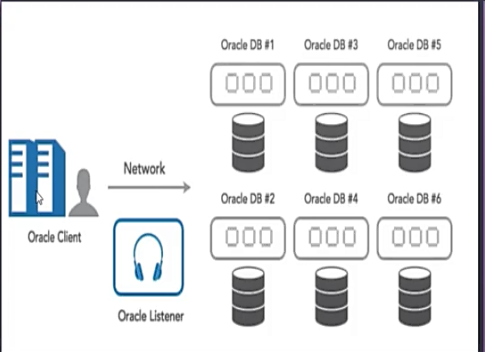
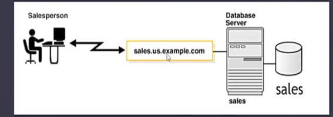
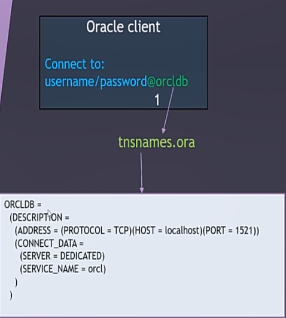
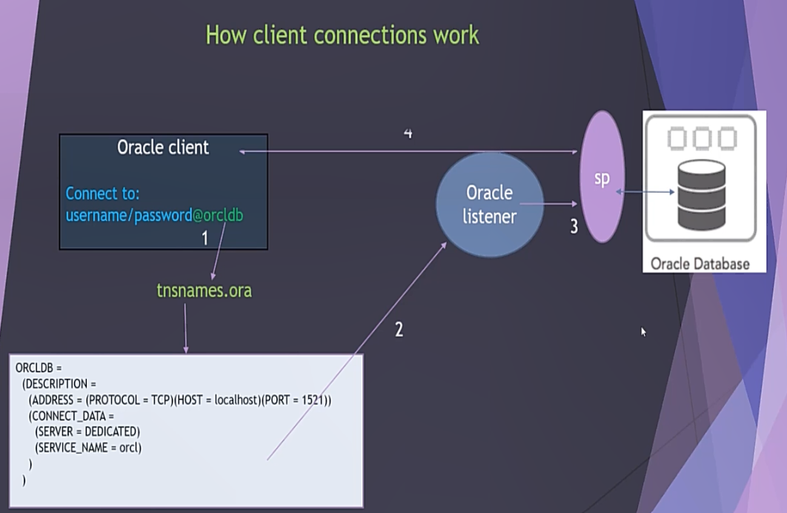
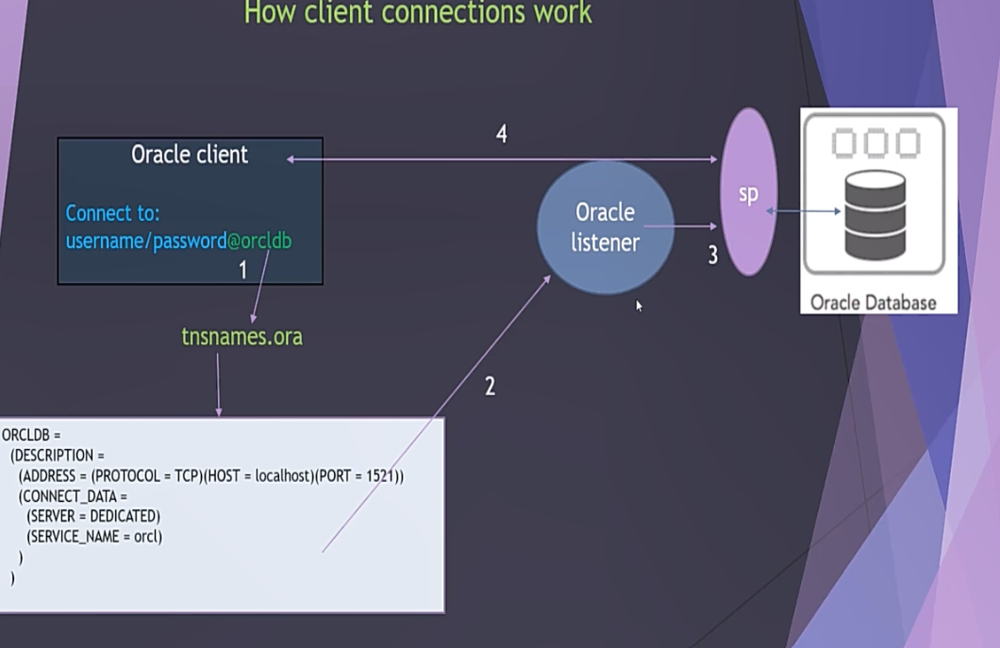

# TCP/IP Network in Oracle Database

## What is TCP/IP?
**TCP/IP (Transmission Control Protocol/Internet Protocol)** is a communication protocol suite used for reliable and efficient data transmission. In Oracle Database environments, it enables seamless communication between database clients and servers, ensuring data integrity and proper delivery of messages over a network.



---

## Role of TCP/IP in Oracle

### 1. Network Connectivity
- TCP/IP serves as the foundation for Oracle Net Services to enable communication between the database client and the server.
- Oracle uses TCP/IP sockets to exchange data between systems over a network.

### 2. Oracle Net (formerly SQL*Net)
- Oracle Net Services depend on TCP/IP to provide transparent data transfer.
- The **TNS Listener**, a process running on the database server, listens for incoming client connections over TCP/IP.

### 3. Port Numbers
- Oracle Database typically uses port **1521** as the default for TCP/IP communication via the TNS Listener.
- This port can be customized in the `listener.ora` configuration file.

---

## How TCP/IP Works in Oracle

### 1. Client Request
A client application (e.g., SQL Developer, SQL*Plus) sends a connection request to the Oracle database server using the TCP/IP protocol.

### 2. Listener Process
- The Oracle **TNS Listener** running on the server receives the request on the specified port (default **1521**).
- The listener maps the request to the appropriate database instance based on its configuration.



### 3. Session Establishment
- After validating the request, the listener establishes a session over the TCP/IP connection.
- The client can then communicate directly with the database instance.



### 4. Data Transfer
Query results, error messages, and other data are exchanged over the TCP/IP connection between the client and server.

---

## Key Oracle Net Configuration Files

### 1. Client-Side
- **`tnsnames.ora`**: Contains network service names mapped to database connect descriptors.

### 2. Server-Side
- **`listener.ora`**: Configures the TNS Listener, including port numbers, protocol addresses, and database services.

---

## How the TNS Listener Works
1. The listener is responsible for receiving initial connection requests.
2. Once the connection is established, the listener hands off the session to the database server process.
3. After the session is established, the listener is no longer involved in the communication between client and server.



---

## Testing Connectivity
You can test the connectivity between the client and server using the following tools:

### 1. `tnsping`
- Use the `tnsping` command to verify that the client can reach the listener.

```bash
tnsping <service_name>
```

### 2. SQL*Plus
- Use SQL*Plus to establish a test connection to the database:

```bash
sqlplus <username>/<password>@<service_name>
```

### 3. Listener Status
- Check the status of the TNS Listener on the server:

```bash
lsnrctl status
```



---

## Example Configuration Snippets

### `listener.ora` (Server-Side)
```plaintext
SID_LIST_LISTENER =
  (SID_LIST =
    (SID_DESC =
      (SID_NAME = orcl)
      (ORACLE_HOME = /u01/app/oracle/product/19.0.0/dbhome_1)
    )
  )

LISTENER =
  (DESCRIPTION_LIST =
    (DESCRIPTION =
      (ADDRESS = (PROTOCOL = TCP)(HOST = localhost)(PORT = 1521))
    )
  )
```

### `tnsnames.ora` (Client-Side)
```plaintext
ORCL =
  (DESCRIPTION =
    (ADDRESS_LIST =
      (ADDRESS = (PROTOCOL = TCP)(HOST = localhost)(PORT = 1521))
    )
    (CONNECT_DATA =
      (SERVICE_NAME = orcl)
    )
  )
```

---

## Diagrams

### TNS Listener Process

1. **Connection Request**: Client sends a connection request to the listener.
2. **Listener Matches Request**: The listener matches the request to the correct database instance.
3. **Connection Hand-Off**: Listener hands off the session to the database server.


---

### Testing Connectivity Workflow
1. Use `tnsping` to check listener availability.
2. Verify database session using SQL*Plus or another client.
3. Use `lsnrctl` to check listener status.

---

### Notes
- The TNS Listener is only needed during the initial connection phase.
- Once the connection is established, the client communicates directly with the server process.

---


