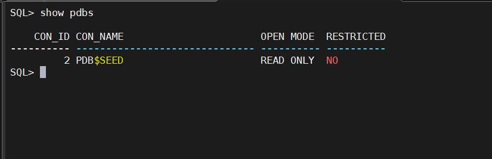

# Oracle Database Connection and Setup Guide

## 1. Set Oracle Environment Variables

```bash
# Set the Oracle SID environment variable
export ORACLE_SID=PROD

# Check the status of the listener
lsnrctl status

# Navigate to the Oracle database directory
cd $ORACLE_HOME/dbs

# List the spfile for the PROD database
ll --spfile=PROD.ora
```
# Oracle Database Connection and Setup Guide

# Connect as SYSDBA user
```bash
    sqlplus / as sysdba
```
# Display the current user
```sql
    show user;
```
# Install rlwrap on Oracle Linux 8 for Better Command-Line Editing

## Install EPEL release
```bash
rpm -Uvh https://dl.fedoraproject.org/pub/epel/epel-release-latest-8.noarch.rpm

yum install rlwrap
rlwrap sqlplus / as sysdba
```

# Usage of SPFILE

## View SPFILE
You can view the initialization parameters in the SPFILE using the SQL query:

```sql
SHOW PARAMETER;
CREATE SPFILE FROM PFILE;

Here is the content formatted in README.md format:

# Usage of SPFILE

## View SPFILE
You can view the initialization parameters in the SPFILE using the SQL query:

```sql
SHOW PARAMETER;

Creating SPFILE

You can create an SPFILE from a PFILE with the following command:

CREATE SPFILE FROM PFILE;

Using SPFILE to Start the Database

When starting the database, Oracle will use the SPFILE by default if it is located in the correct directory (typically $ORACLE_HOME/dbs for UNIX/Linux systems). You can also specify a specific SPFILE location like this:

sqlplus / as sysdba
STARTUP PFILE='/path/to/pfile';

SPFILE vs PFILE
Feature	SPFILE	PFILE
Format	Binary	Text-based
Changes Persistence	Automatically persists changes	Requires manual edits and reload
Dynamic Updates	Yes	No
Used for RAC	Yes	No

```sql
create pfile from spfile='/u01/oracle/product/19.3.0.0/dbhome_1/dbs/spfilePROD.ora';
```

```sql
show pdbs;
```



```sql
describe v$pdbs;
select name from v$pdbs;
describe cdb_pdbs;
select pdb_name, status from cdb_pdbs;
show con_name;
```