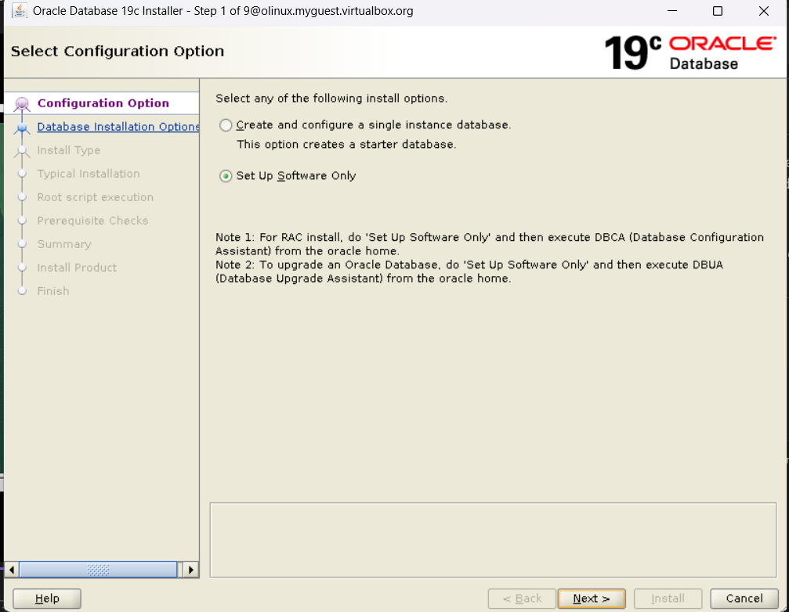
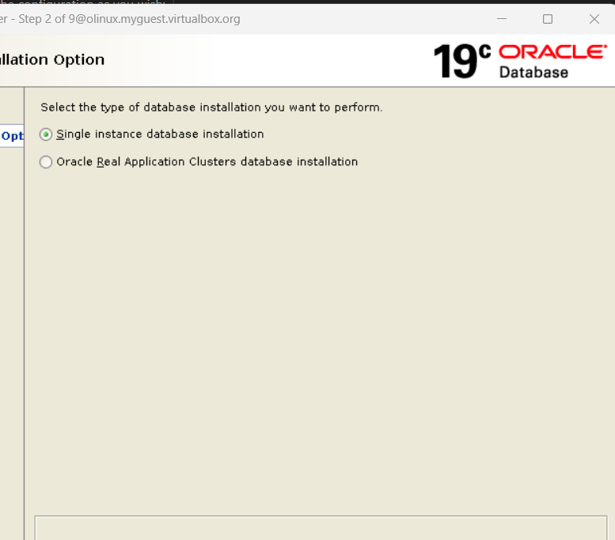
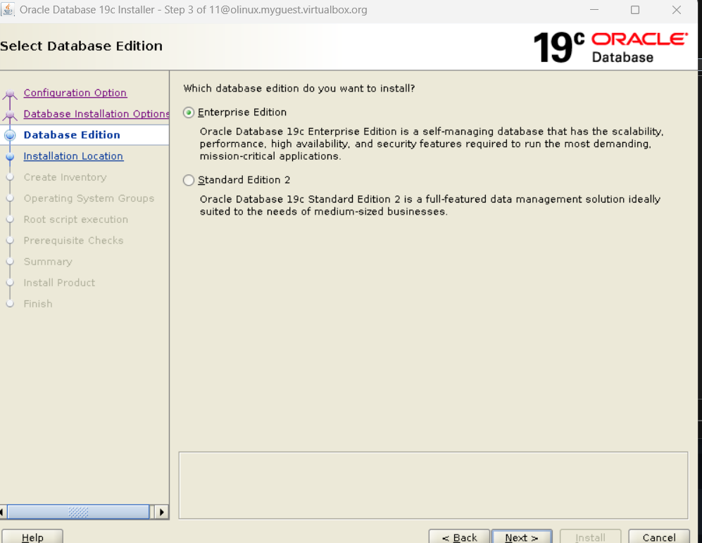
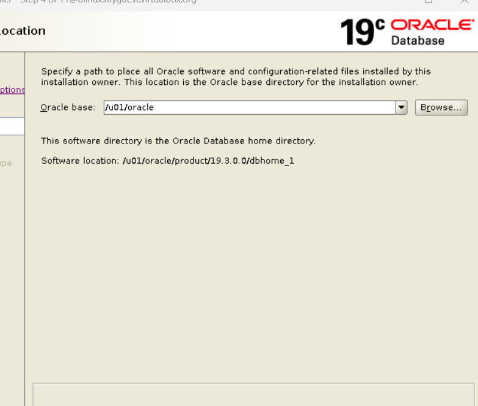
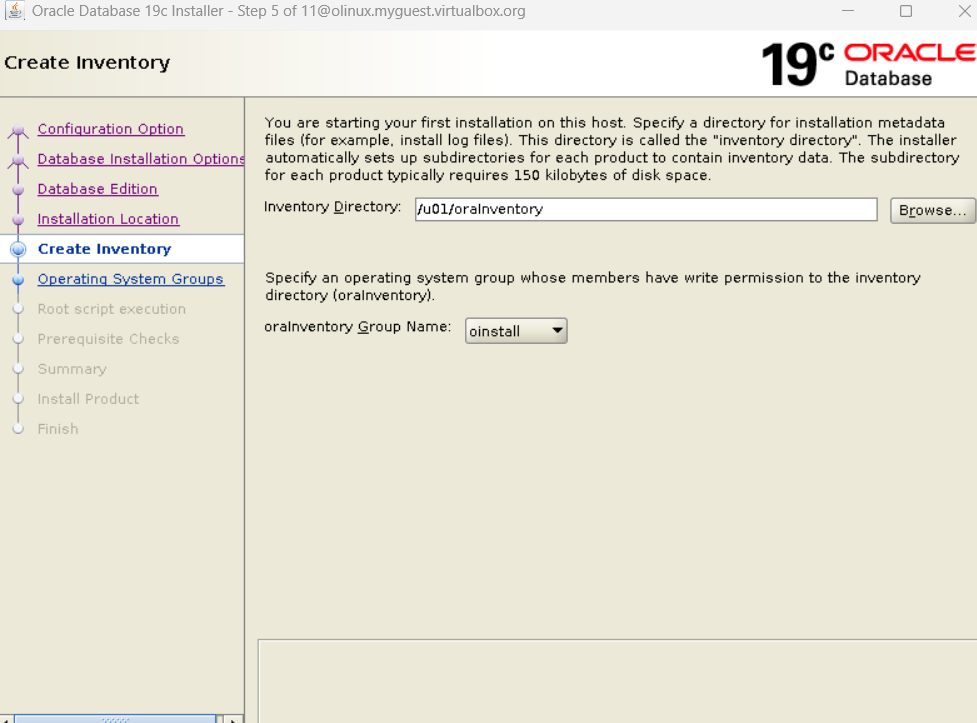
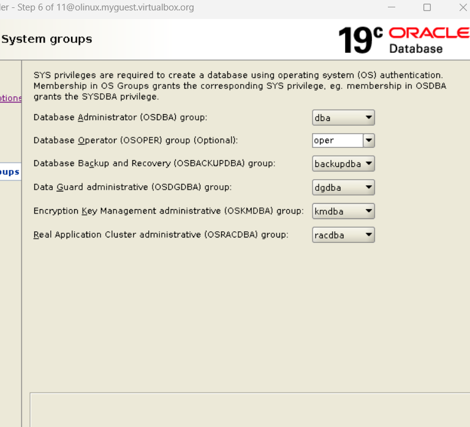
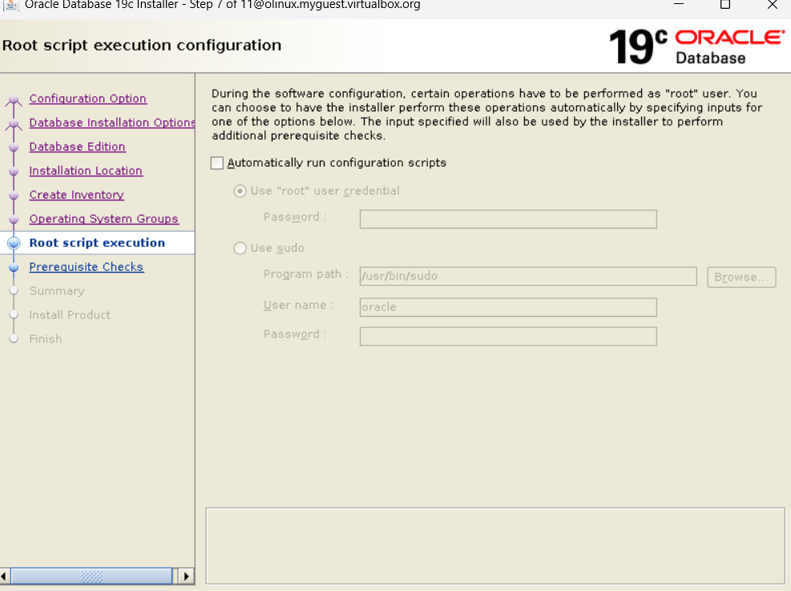
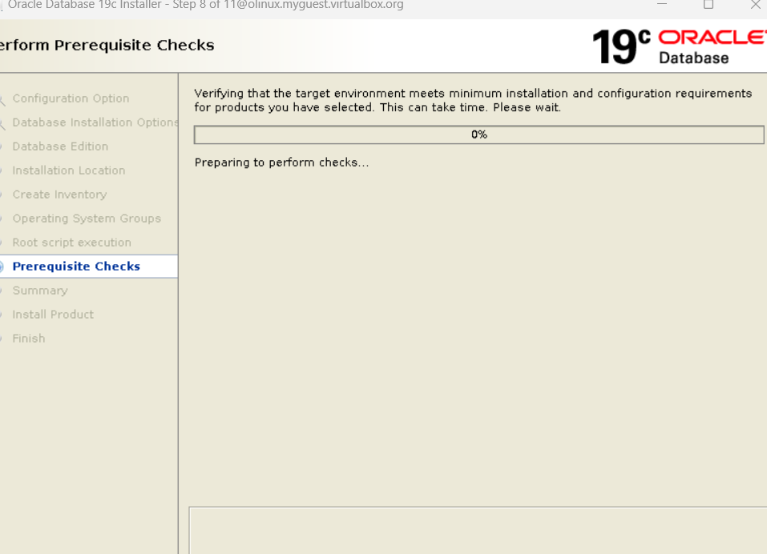
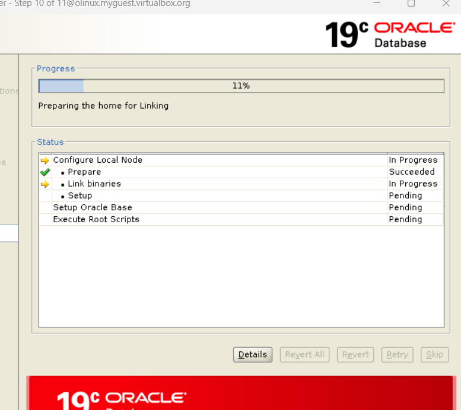
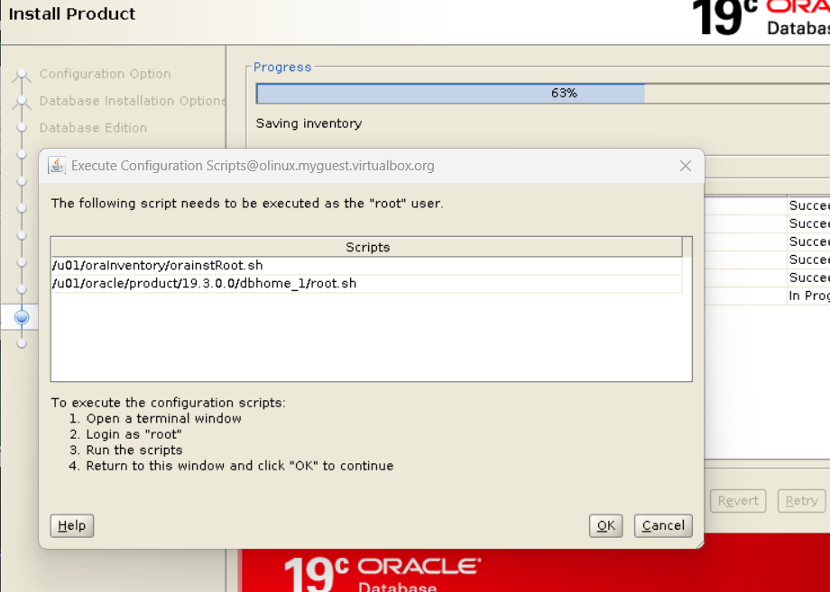

# Sweet Oracle Installation 19c

This guide provides detailed steps to install Oracle Database 19c on Oracle Linux using VirtualBox. Written by Partow Moradi.

## Step 1: Install VirtualBox
1. Go to the [VirtualBox Downloads page](https://www.virtualbox.org/wiki/Downloads) and download the installer for your operating system.
2. Install VirtualBox following the instructions for your OS.

---

## Step 2: Download Oracle Linux ISO
1. Visit the [Oracle Linux ISOs page](https://yum.oracle.com/oracle-linux-isos.html).
2. Download the ISO file for Oracle Linux (Version 8.8 recommended).

---

## Step 3: Create a Virtual Machine in VirtualBox
1. Open VirtualBox and click **New**.
2. Enter a name (e.g., Olinux) and set the type to **Linux** and version to **Oracle (64-bit)**.
3. Allocate at least 4 GB of RAM (8 GB or more is recommended).
4. Create a virtual hard disk (e.g., 60 GB or more).

---

## Step 4: Configure the Virtual Machine
1. Open the **Settings** for the newly created VM:
   - **System > Processor**: Allocate at least 2 CPUs.
   - **Storage > Controller: IDE**: Add the Oracle Linux ISO file as a virtual optical disk.
   - **Network > Adapter 1**: Enable it and set it to **Bridged Adapter** or **NAT** (depending on your network setup).

---

## Step 5: Install Oracle Linux
1. Start the VM and boot from the ISO.

---

## Step 6: Update the System
1. Log in as `root`.
2. Run the following commands to update the system:
   ```bash
   sudo dnf update -y
   sudo dnf install oracle-database-preinstall-19c -y
   ```

---
# Configuring Hostname and Hosts File

Ensure the `/etc/hosts` file contains a fully qualified name for the server


Set the correct hostname in the `/etc/hostname` file


---

## Step 7: Install and Configure VNC for GUI Access
1. Install a graphical environment and VNC server:
   ```bash
   yum group install -y "Server with GUI"
   yum group list
   yum install tigervnc-server -y
   exit
   vncpasswd
   ```
2. Set up the VNC server for the oracle user:
   ```bash
   sudo cp /lib/systemd/system/vncserver@.service /etc/systemd/system/vncserver@:1.service
   sudo nano /etc/systemd/system/vncserver@:1.service
   ```
   Replace `<USER>` with `oracle` in the `ExecStart` line. If there is no `<USER>`, do not change the file.
3. Start and enable the VNC server:
   ```bash
   sudo systemctl daemon-reload
   sudo systemctl enable vncserver@:1.service
   sudo systemctl start vncserver@:1.service
   sudo systemctl status vncserver@:1.service
   ```
4. Check the VNC port:
   ```bash
   netstat -pentaul | grep vnc
   ```
5. Set up port forwarding in VirtualBox:
   - Guest port: **5901**
   - Host port: **5901**
6. Use a VNC client (e.g., connect to `127.0.0.1:5901`) to access the VM.



---

## Step 8: Download and Install Oracle Database 19c
1. Download Oracle Database 19c software from the [Oracle Database Downloads page](https://www.oracle.com/de/database/technologies/oracle19c-linux-downloads.html).

2. Install required X11 apps for graphical installation:
   ```bash
   sudo dnf config-manager --enable ol8_codeready_builder
   sudo dnf install xorg-x11-apps -y
   ```
3. Create required directories and set permissions:
   ```bash
   sudo mkdir -p /u01
   su - oracle
   mkdir -p /u01/oracle/product/19.3.0.0/dbhome_1
   mkdir -p /u01/oraInventory
   mkdir -p /u01/proddata
   su - root
   mv /root/Downloads/LINUX.X64_193000_db_home.zip /u01/oracle/product/19.3.0.0/dbhome_1/
   chown oracle:oinstall /u01/oracle/product/19.3.0.0/dbhome_1/LINUX.X64_193000_db_home.zip
   su - oracle
   cd /u01/oracle/product/19.3.0.0/dbhome_1/
   unzip LINUX.X64_193000_db_home.zip
   rm -rf LINUX.X64_193000_db_home.zip
   ```
4. Reboot the VM:
   ```bash
   sudo init 6
   ```
5. Take a snapshot of your VM for safety.
6. Login as `oracle` and start the Oracle installer:
   ```bash
   cd /u01/oracle/product/19.3.0.0/dbhome_1/
   ./runInstaller
   ```

### Error Encountered
If you encounter the following error:
```bash
DISPLAY=<machine-name>:0.0; export DISPLAY
export CV_ASSUME_DISTID=OEL8.8
./runInstaller
```


## Notes
- Ensure you follow each step carefully to avoid installation errors.
- Oracle Linux ISOs and Database software can be downloaded from Oracle's official site.


## follow the pictures and you can change the configuration as you wish:


















### here run the these two scripts with root user 


1. Add these variables to `~/.bashrc` with oracle user:
   ```bash
   export ORACLE_BASE=/u01/oracle
   export ORACLE_HOME=/u01/oracle/product/19.3.0.0/dbhome_1
   export PATH=$ORACLE_HOME/bin:$PATH
   ```
2. Verify the changes:
   ```bash
   env | grep oracle
   ```

---